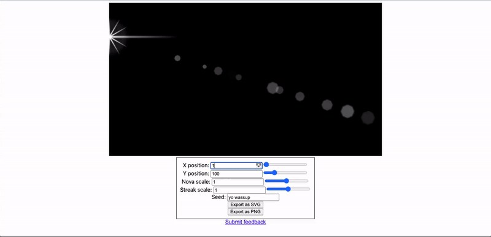

# Lens flare renderer with SVG
Using SVG paths to render lens flare.

<h2>Usage</h2>
Open a photo editor (Photoshop, Affinity Photo, etc.) and place a horizontal and vertical guide intersecting at the point where the light is being emitted. Enter the position of the horizontal guide, in pixels, into <b>X position</b>, and the vertical into <b>Y position</b>. Export the flare as a PNG and drag the file onto your document. Set the layer's blend mode to <b>Linear dodge</b> or <b>Add</b> or whatever they call it in your editor.